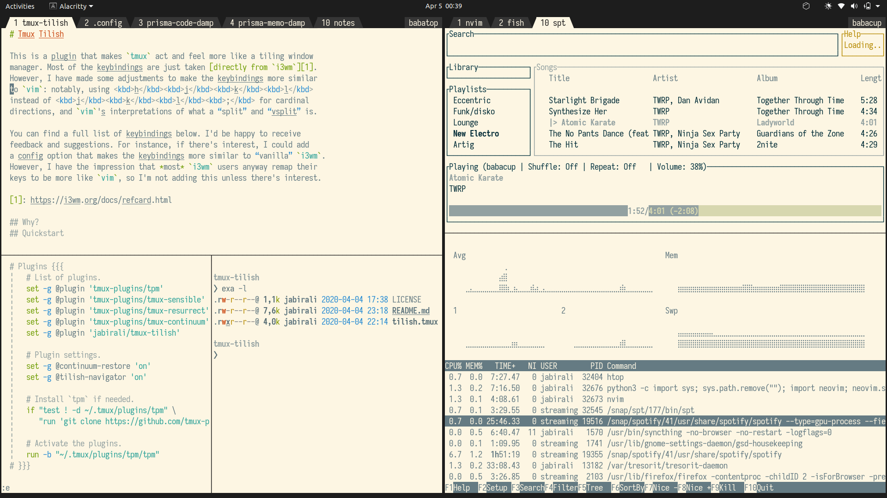

# Tmux Soltab

There isn't that much to say. It's a Solarized Light theme for `tmux`,
with a status line that looks like traditional GUI tabs:

The statusline background color is set to `#1d1d1d` to fit well with a surrounding
Ubuntu desktop when run in a borderless terminal, but should look fine in other
settings too. The theme itself sets the background color of each `tmux` pane to
Solarized Light, so I'd recommend setting your terminal background color to a
matching `#1d1d1d` to avoid a bright white line around the tab bar. The top
right corner of the setup shows the current hostname and session name.

If you don't like Solarized Light, the colors are also customizable. You can customize 
the color of the foreground (text), background, statusline, unfocused tab background,
unfocused tab foreground, the inactive and active pane borders, and the right 
statusline background and foreground.

The attributes to set are as follows: foreground background statusline unfocustab_bg 
unfocustab_fg focustab_fg statuslineright_bg statuslineright_fg paneborder activepaneborder

To modify these colors, add something like this to your `tmux.conf`:

    set -g @soltab-foreground '#1d1d1d'

The argument should be a hexadecimal color value. Replace the word 'foreground' in the 
example above with any of the other attributes you'd like to customize. 

You can assign colors to all of the above attributes. If you'd prefer, though,
you can just set colors for 'foreground', 'background', 'statusline', and 'unfocustab_bg'.
The rest of the colors will default to be the same as one of the ones you've set. 

To add the powerline tab edges as shown in the picture, add this to your `tmux.conf`:

    set -g @soltab-powerline 'on'

Without this option, the tabs will have squared corners

To install this plugin with [`tpm`][1], add this to your `tmux.conf`:

	set -g @plugin 'jabirali/tmux-soltab'

[1]: https://github.com/tmux-plugins/tpm

